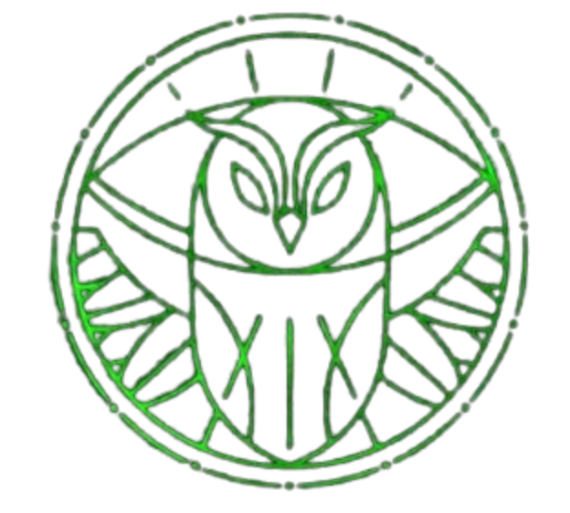

# Welcome to the Magnus Institute Character Builder

_"Make your statement. Face your fear."_

This site is hopefully intended to help you guys fill out your "Resumes" for **The Magnus Archives TTRPG**. This will, at a later date, be transferred into full character sheets. However we are taking a piecemeal approach for simplicity sake.
I’ve limited the rulebook to only the sections you need in order to make it less overwhelming and to try and avoid spoiling plot points. Even the sections I’ve given you have some light spoilers and meta knowledge that your characters simply won’t have (maybe if you choose the occultist type but still). If you think something might be considered meta knowledge please talk to me before you go into the game thinking your character might know it.

Feel free to also view this [Example Resume](https://docs.google.com/document/d/1snHpjgP5YTR79IViiTZ6rHR8q54Uc19cGqiIeuR8T0Y/edit?usp=sharing) to get an idea of how it should look after you've created it.

---

## Getting Started

Follow the steps below in order to be able to fill out your provided character resume:

### 1. Choose A Position

These positions are mainly to add extra flavor to your character and give them a purpose and really only servers to alter roleplay and character interactions. However, if you choose **Head Archivist** you will be endowed with additional responsibilites.
Before each session you will record yourself reading a "Statement" after which I will process it and ensure it is ready for our next session. This statement is a first hand account of the paranormal or supernatural. The statement will be written by me and other players on a rotating basis. I will explain how to write statements in further detail later.

### 2. Choose a Type

visit [Types](/TMAQuickStart/types.html) and after reading your options select from the following:
- Investigator
- Protector
- Elocutionist
- Occultist

Each Type has different base stat distributions and abilities. Write down your character type under the "Character Concept" section of your resume.
_I am a [Descriptor] ->[Type]<- who [Focus]._

### 3. Assign Stats

You start with:
- Effort: 1
- Edges: Determined by character Type.
- Stat Pools: Determined by character Type.
- Assign **6 extra points** among:
  - Might
  - Speed
  - Intellect

- Ex. stats of an Investigator type
  - Might: 10
  - Speed: 9
  - Intellect 9
  - Speed edge: 1
  - Might edge: 0
  - Intellect edge: 1

- Ex. After 6 extra point distribution
  - Might: 14 (+4)
  - Speed: 11 (+2)
  - Intellect 9
  - Speed edge: 1
  - Might edge: 0
  - Intellect edge: 1 
 
  Write down your stats in the character resume.

### 4. Choose a Descriptor

Your Descriptor defines your personality as well as grants you 1 skill (if you select two skills, you will also need to take an inability. If you do this please talk to me so I can give you the list of inabilities.) and a stat bonus. See the [Descriptors](/TMAQuickStart/descriptors.html) sidebar in order to make your selection.
After selecting please apply your stat bonus, note your skill (in the qualifications resume section), and write down your selected descriptor in the character concept resume section.
_I am a ->[Descriptor]<- [Type] who [Focus]._

### 5. Choose a Focus

This defines your unique talent or mystery, we are going to try to not have duplicate Foci, please communicate with the other players what foci you have selected. See [Foci](/TMAQuickStart/foci.html).
There is quite a bit of information in Foci that will not be relevant until I give you all character sheets, but do select carefully based on its description and offered abilities. After selecting please write down your selected focus in the character concept section of the resume.
_I am a [Descriptor] [Type] who ->[Focus]<-._

### 6. Choose 2 Cyphers

Temporary powers that reflect instinct, supernatural phenomena, or momentary clarity. Each Cypher has a level that determines the strength of the Cypher (often 1d6 or 1d6+X, could make cypher last longer, be more potent etc.) and a specific effect. Full list in [Cyphers](/TMAQuickStart/cyphers.html) section. After selecting your cyphers, please notate them in the Cyphers section of the Qualifcations section on your character resume.

---

## Done!

Alright that's more or less it for now! Please submit ur resume to me!
